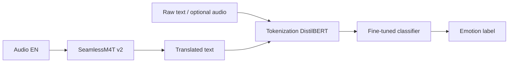

# Multilingual-Emotion-prediction-nlp
# EmoTrans: Multilingual Speech Translation & Emotion Classification

Fine-tune **DistilBERT** for text emotion recognition on the [dair-ai/emotion](https://huggingface.co/datasets/dair-ai/emotion) dataset, with optional integration of **Meta SeamlessM4T v2** for multilingual speech-to-text/speech translation. Built and documented from a Google Colab workflow.

---

## Table of Contents

- [Overview](#overview)
- [Features](#features)
- [Project Structure](#project-structure)
- [Requirements](#requirements)
- [Installation](#installation)
- [Dataset](#dataset)
- [Workflow](#workflow)
- [Model Training](#model-training)
- [Evaluation](#evaluation)
- [Inference Demo](#inference-demo)
- [Results](#results)
- [Limitations](#limitations)
- [Future Work](#future-work)
- [References](#references)
- [License](#license)

---

## Overview

This project explores **emotion prediction from text** using transformer-based NLP. The pipeline includes:

1. **Exploratory analysis** of the Emotion dataset (class distribution, labeling).
2. **Tokenization** with `distilbert-base-uncased`.
3. **Fine-tuning** `DistilBERT` for 6-way emotion classification.
4. **Evaluation** on a held-out test set (accuracy, weighted F1, classification report).
5. **Optional extension**: multilingual speech translation via **SeamlessM4T v2**, then emotion inference on translated text.

Emotion classes: `sadness`, `joy`, `love`, `anger`, `fear`, `surprise`.

---

## Features

| Component | Technology |
|-----------|------------|
| Emotion dataset | Hugging Face `dair-ai/emotion` |
| Tokenizer & classifier | `distilbert-base-uncased` |
| Training | Hugging Face `Trainer` + `TrainingArguments` |
| Metrics | Accuracy, weighted F1 |
| Speech (optional) | Meta `seamlessM4T_v2_large` (S2ST / S2TT) |
| Visualization | Matplotlib, class frequency plots |

---

## Project Structure

```
emotion-prediction/
├── README.md                 # This file
├── REPORT.md                 # Full project report (methods, outcomes, future work)
├── requirements.txt          # Python dependencies
├── .gitignore
└── notebooks/
    └── Emotion_Prediction.ipynb   

## Requirements

- Python 3.9+
- GPU recommended (CUDA) for DistilBERT fine-tuning and SeamlessM4T
- ~4 GB disk for models and cached datasets

### Core (emotion classification)

- `transformers`, `datasets`, `accelerate`, `torch`, `scikit-learn`, `pandas`, `matplotlib`

### Optional (speech translation block)

- `torchaudio`, `soundfile`, `pydub`, `seamless_communication` (Meta SeamlessM4T)

---

## Installation

```bash
git clone https://github.com/YOUR_USERNAME/emotrans-emotion-nlp.git
cd emotrans-emotion-nlp
pip install -r requirements.txt
```

For SeamlessM4T (optional, heavier setup):

```bash
pip install fairseq2 pydub sentencepiece
pip install git+https://github.com/facebookresearch/seamless_communication.git
```

---

## Dataset

**Source:** [`dair-ai/emotion`](https://huggingface.co/datasets/dair-ai/emotion) on Hugging Face.

| Split | Typical size |
|-------|----------------|
| train | 16,000 |
| validation | 2,000 |
| test | 2,000 |

Each row contains `text` and `label` (integer 0–5). Labels are mapped to human-readable names for analysis and reporting.

```python
from datasets import load_dataset

emotion = load_dataset("emotion")
classes = emotion["train"].features["label"].names
# ['sadness', 'joy', 'love', 'anger', 'fear', 'surprise']
```

---

## Workflow



1. Load and format the Emotion dataset (pandas for EDA).
2. Tokenize all splits with `AutoTokenizer`.
3. Fine-tune `AutoModelForSequenceClassification` (6 labels).
4. Evaluate on validation (per epoch) and test (final metrics).
5. *(Optional)* Run SeamlessM4T on English audio → translated string → emotion model.

---

## Model Training

**Checkpoint:** `distilbert-base-uncased`  
**Head:** sequence classification, `num_labels=6`

Example training configuration:

| Hyperparameter | Value |
|----------------|-------|
| Epochs | 2 |
| Learning rate | 2e-5 |
| Batch size (train/eval) | 64 |
| Weight decay | 0.01 |
| Evaluation | per epoch |

```python
from transformers import TrainingArguments, Trainer, AutoModelForSequenceClassification

training_args = TrainingArguments(
    output_dir="distilbert-finetuned-emotion",
    num_train_epochs=2,
    learning_rate=2e-5,
    per_device_train_batch_size=64,
    per_device_eval_batch_size=64,
    weight_decay=0.01,
    evaluation_strategy="epoch",
)

trainer = Trainer(
    model=model,
    args=training_args,
    compute_metrics=compute_metrics,
    train_dataset=emotions_encoded["train"],
    eval_dataset=emotions_encoded["validation"],
    tokenizer=tokenizer,
)
trainer.train()
```

**Metrics function:** weighted F1 and accuracy.

---

## Evaluation

```python
preds_outputs = trainer.predict(emotions_encoded["test"])
# accuracy, f1 on test split

from sklearn.metrics import classification_report
print(classification_report(y_true, y_preds, target_names=classes))
```

Report per-class precision, recall, and F1 in `REPORT.md` after you paste your run numbers.

---

## Inference Demo

**Text-only emotion prediction:**

```python
text = "I am feeling lonely"
inputs = tokenizer(text, return_tensors="pt").to(device)
with torch.no_grad():
    logits = model(**inputs).logits
pred_id = torch.argmax(logits, dim=1).item()
print(classes[pred_id])
```

**With translated speech text (notebook pattern):**

```python
tex_str = str(translated_text_from_seamless)
inputs = tokenizer(tex_str, return_tensors="pt").to(device)
# same forward pass → predicted emotion
```

---

## Results

Fill in after your final Colab run (example placeholders):

| Metric | Test set |
|--------|----------|
| Accuracy | _TBD_ |
| Weighted F1 | _TBD_ |
| Best class (F1) | _TBD_ |
| Weakest class (F1) | _TBD_ |

Training artifacts:

- `distilbert-finetuned-emotion/` — checkpoints and logs from `Trainer`

See **[REPORT.md](REPORT.md)** for methodology, outcomes, and future work in detail.

---

## Limitations

- Emotion model is trained on **English tweets**; performance drops on noisy, misspelled, or non-English text unless retrained.
- SeamlessM4T block requires GPU, large model download, and audio under ~20 s for best quality.
- Notebook uses `df` / `df1` inconsistently in one EDA cell — fix `df1` → `df` when re-running locally.
- `evaluation_strategy='epoch'` may need `eval_strategy='epoch'` on newer `transformers` versions.

---

## Future Work

- Train on multilingual emotion corpora or translate-then-label pipelines.
- Add speech emotion recognition (wav2vec2 / HuBERT + classifier).
- Deploy via Gradio or FastAPI for text/audio upload.
- Compare DistilBERT vs RoBERTa vs small LLM prompts for emotion.
- Confusion-matrix and SHAP/LIME explainability for misclassified samples.

Details: [REPORT.md — Future Work](REPORT.md#6-future-work)

---

## References

- [DistilBERT](https://huggingface.co/distilbert-base-uncased) — Sanh et al., Hugging Face
- [Emotion dataset](https://huggingface.co/datasets/dair-ai/emotion) — dair-ai
- [SeamlessM4T](https://github.com/facebookresearch/seamless_communication) — Meta AI
- [Hugging Face Trainer](https://huggingface.co/docs/transformers/main_classes/trainer)


**Author:** _Kashaf Noureen_  
**Contact:** _noureenkashaf@gmail.com_
